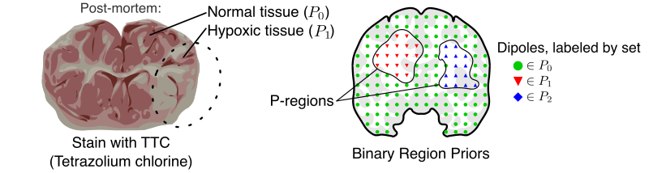

# Electric Source Imaging with Binary Region Priors

A central task for Neuroscience is to determine the location of electrical activity of neural origin inside the brain. 
Electrical Source Imaging (ESI) is a particular framework for neural electrical source location.

Although the basic formulation of ESI constitutes an ill-posed problem (in the sense of Hadamard), it may be augmented by modeling any additional information we may have about the electrical sources. For instance, minimal-norm estimators assume that the most plausible estimation is that with a lower norm. 
However, minimal-norm ESI estimators possess a low resolution in space.

In my PhD dissertation, we constructed a novel ESI estimator incorporating binary anatomical data from pathologies observed in the post-mortem to improve its spatial resolution.

Furthermore, the methodology developed in my PhD dissertation can be extended to incorporate similar types of binary data derived from various imaging modalities, such as fMRI, NIRS, and CT, among others.

The interested reader may refer to [my dissertation](https://mavmatrix.uta.edu/math_dissertations/162/). 
The presentation was recorded, and it is available [here](https://drive.google.com/file/d/1jC29LfYxnKniUrf4qTJaTYbJNPSoyBz7/view?usp=sharing); 
the slides can be accessed [here](https://drive.google.com/file/d/1jCc60A6hyuYjBBVgBPFIjxB2DwLOZxNE/view?usp=sharing).

## Algorithm Summary

_A grosso modo_, we construct the spatial priors based on observations from low-resolution imaging modalities. For instance, we use pictures from post-mortem symptoms of a stroke.

# Brainstorm Implementation

[Brainstorm](https://neuroimage.usc.edu/brainstorm/Introduction) is a Matlab toolbox for analyzing brain recordings, including, but not limited to, MEG, EEG, fNIRS, ECoG, etc. In the context of Electrical Source Imaging, Brainstorm offers integrations with state-of-the-art toolboxes such as CAT12 for processing anatomical MRI data and OPENMEEG for solving the forward problems of EEG vs. electrical dipoles.

## Setup

To run these scripts, you need a working installation of Brainstorm. This can be achieved by following the [official tutorial](https://neuroimage.usc.edu/brainstorm/Installation). 

To **install** the proposed algorithm into your local Brainstorm, do as follows:

1. Note the folder `~/.brainstorm/process`, which is designated for user-defined processes. 

2. Go to this repository's `Brainstorm` folder and download `process_RegionPriors.m`.

3. Download the file `process_(...).m` and move it to `~/.brainstorm/process`

Notice that other algorithms are included in the `Brainstorm' folder. They were implemented to compare against the proposed method.

Now, to **use** the algorithm, you need data pre-processed to perform a Source Reconstruction. 
This requires that the database contains the subject's anatomy data, sensor data, and electrode positions. 

The appropriate methods are beautifully explained in the [Brainstorm tutorials](https://neuroimage.usc.edu/brainstorm/Tutorials#Get_started). 

Once the data is already in the database, the algorithms provided here can be run as follows:

0. Start Brainstorm as usual.

1. Select the sensor data and drag it to the `Run' section.

2. Select the `Run` button to open the Pipeline editor.

3. Use the cog to open the menu of processes.

4. Navigate to `Sources / Binary Region Priors`.

5. Multiple options are available for selection, such as the heuristic for hyperparameter tuning.

The results will be saved to the database as any other Source Reconstruction method mentioned in the tutorials.

Double-click on it on the new file **and** the sensor data to explore visually the sources as they evolve in time.

# Measurement of Algorithm Performance

Unlike the Brainstorm implementation, the performance metrics were not designed with the final user in mind. Instead, they are designed to make it easier to implement different types of synthetic data, hyperparameter tuning heuristics, ESI solvers, performance metrics, and posterior analysis.

They are available to the public, hoping that future work can be implemented faster.

## Setup

1. Download the contents of the `Pure Matlab` folder. Although this folder can be renamed safely, it will be referred to as such for ease of notation.

2. Inside the `Pure Matlab` folder, create a folder named `data`.

3. Download the folder `anat_ref` from [this link](https://drive.google.com/drive/folders/1bwrJiAwzQgX9c09XAP01Bx7J5I7iN4oC?usp=sharing) and copy it inside the `Pure Matlab` folder. This folder was excluded from the repository because it included large files.

### Including more anatomy models

The folder `anat_ref` contains anatomical data from the ICBM152 template and two head models made from (1) sources at the cortex whose orientation is orthogonal to it and (2) approximately 5,000 dipoles on the brain volume with free orientation.

- If you have anatomical data already loaded into the Brainstorm database, export the head and cortex surfaces to the Matlab workspace as `cortex` and `head`, respectively. Save both variables into a single file in the `anat_ref` folder.

- If you have the head model already loaded into the Brainstorm database, export it to the Matlab workspace as `forward`. Save this variable to a file in the `anat_ref` folder.

Using a forward model with anatomical data from another subject will make the identification of dipoles inside the brain fail.

The original purpose of using two separate files is to consider multiple head models for the same subject, enabling the exploration of model misspecification: what if the true source is at the cortex, but a volume model is used? What if the true source was modeled using one grid, but the inverse solution was computed using a different grid?

## Running

(TODO) Continue documentation.